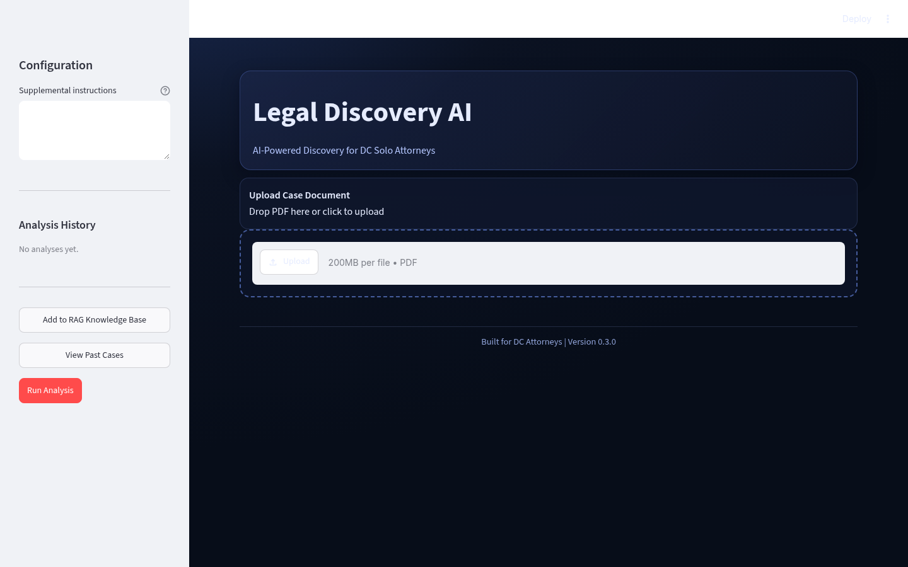

# Legal Discovery AI

**Production-oriented multi-agent legal discovery pipeline** for solo and small-firm attorneys.

Built with CrewAI + LangChain-style tooling. Parses legal PDFs, extracts entities, flags privilege / fraud / compliance risks, and generates structured case briefs grounded in prior matters via RAG.

## Why this exists

Manual discovery review is slow and error-prone. This system turns a document upload into a usable attorney-facing brief with risk signals and next steps in minutes.

## Key capabilities

- PDF parsing + OCR-friendly extraction (entities, metadata, timelines)
- Risk flagging: PII redaction, attorney-client privilege, fraud indicators, FAR / DC Code signals
- Structured case brief generation (parties, issues, critical risks, missing elements, actionable next steps)
- Simple RAG over past cases for grounded recommendations
- Streamlit attorney UI with live agent status, progress, and one-click Markdown / PDF / JSON export
- Provider fallbacks so the workflow stays usable when a model or tool fails

## Tech stack

- **Python** + CrewAI / LangChain ecosystem
- FastAPI (backend endpoints)
- Streamlit (attorney interface)
- RAG over local past-case directory
- Supports Anthropic, OpenAI, Gemini

## Quick start

```bash
# Python 3.11 or 3.12 recommended
python -m venv .venv
source .venv/bin/activate   # or .venv\Scripts\activate on Windows
pip install -r requirements.txt
pip install -e .

cp .env.example .env
# Add ANTHROPIC_API_KEY (preferred) or OPENAI_API_KEY / GEMINI_API_KEY
```

**CLI**
```bash
python -m legal_discovery_ai.crew --document-path data/sample.pdf
```

**UI**
```bash
streamlit run src/legal_discovery_ai/app.py
```


## Demo

Live Streamlit attorney UI (`streamlit run src/legal_discovery_ai/app.py`) on Linux:




Empty analysis history is real — no invented briefs or fake confidence scores.

## Project layout

```text
src/legal_discovery_ai/
  app.py          # Streamlit UI
  crew.py         # Multi-agent workflow
data/
  past_cases/     # RAG corpus
  uploads/
```

## Notes

- LLM preference: Anthropic Claude → OpenAI → Gemini
- RAG is enabled when an OpenAI key is present; Gemini-only mode falls back gracefully
- Sequential process with memory and verbose logging for easier debugging

Built as a real tool for DC small-firm legal work. Feedback and contributions welcome.
